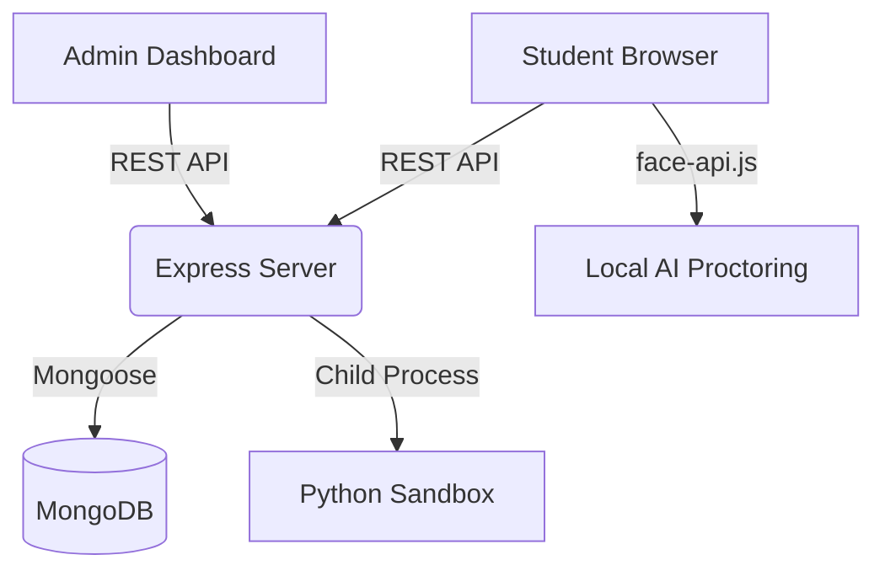

# ProctoGuard: AI-Powered Exam Proctoring System
## Project Documentation for College Presentation

ProctoGuard is a state-of-the-art web application designed to maintain academic integrity in remote examinations through real-time AI monitoring and administrative control.

---

## 🚀 Technical Stack (MERN)

The system is built using the high-performance **MERN** stack, ensuring scalability, speed, and cross-platform compatibility.

### Frontend
- **React.js**: Modern component-based UI framework.
- **Tailwind CSS**: Utility-first CSS for sleek, dark-themed responsive design.
- **Framer Motion**: Advanced animations for smooth UI transitions (modals, tab switching).
- **Face-api.js**: Browser-based neural networks for real-time face detection and tracking.
- **Lucide React**: Clean, lightweight SVG icon system.
- **Vite**: Ultra-fast frontend build tool.

### Backend
- **Node.js**: Event-driven JavaScript runtime for server-side logic.
- **Express.js**: Minimalist web framework for building secure RESTful APIs.
- **MongoDB**: NoSQL database for flexible data storage (users, exams, proctoring results).
- **Mongoose**: Elegant ODM for MongoDB schema modeling.
- **JWT (JSON Web Token)**: Secure, stateless authentication for Students and Admins.

---

## 🎨 Icon Library & Visuals

We utilize **Lucide React** for consistent, high-fidelity visual communication.

| Icon | Purpose | Symbolic Meaning |
| :--- | :--- | :--- |
| `Shield` | **Proctoring** | Trust, security, and integrity. |
| `AlertTriangle` | **Violations** | Immediate attention required for suspicious activity. |
| `Power` | **Activation** | Real-time control over exam availability. |
| `Trash2` | **Deletion** | Permanent cleanup of records. |
| `Edit` | **Management** | Ability to customize and iterate on content. |
| `Users` | **Students** | Community/Student tracking and history. |
| `Eye` | **Proofs** | Verification and evidence-based grading. |

---

## 🛠️ Key Features

### 1. Intelligent AI Proctoring
- **Face Detection**: Ensures the student stays within the frame.
- **Tab Switching Detection**: Automatically logs when a student attempts to use background resources.
- **Verification Snapshot**: Automatic identity capture before starting the exam for admin audit.

### 2. Administrator Command Center
- **Dynamic Exam Creator**: Support for MCQ, MSQ, and Python Coding scenarios with auto-grading.
- **Live Monitoring Dashboard**: Real-time access to student performance and violation logs.
- **Student Management**: Capability to block/unblock students and delete historical records.

### 3. Student Portal
- **Secure Access**: Simple exam key system for immediate test entry.
- **Modern IDE**: Integrated coding environment for scenario-based questions.
- **Performance History**: Personal record of all attempted exams and grades.

---

## 📂 System Architecture

---

## 🔒 Security Measures
- **Password Hashing**: Bcrypt.js used for secure credential storage.
- **Route Guards**: Role-based access control (RBAC) ensuring students cannot access admin features.
- **Sandboxed Execution**: Python code execution is limited by time and system resources to prevent malicious scripts.
